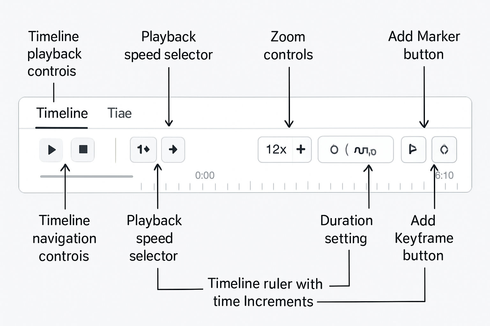
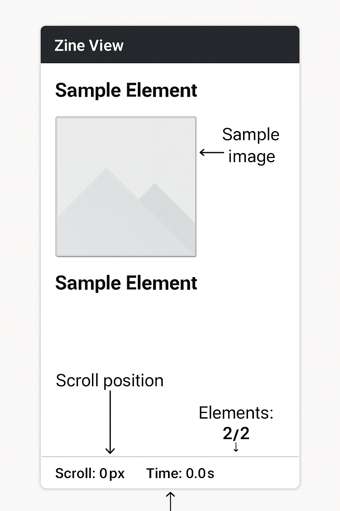

# ChronoCanvas

ChronoCanvas is a web application that combines a time-based moodboard with an interactive zine-like viewing experience. It allows users to create visual narratives by placing elements on a canvas and associating them with specific points on a timeline.

## User Interface

### Editor Mode


The Editor Mode is the main workspace where you can create and modify your canvas:

1. **Navigation Tabs**: Switch between different viewing modes (Editor, Timeline, Zine View, Presentation)
2. **Element Library**: Browse and select from various elements to add to your canvas
3. **Canvas Area**: The main workspace where you arrange and manipulate elements
4. **Properties Panel**: Adjust settings and properties of selected elements
5. **Timeline Controls**: Manage the timing and animation of elements on your canvas

### Timeline Mode


The Timeline Mode provides a dedicated environment for managing the temporal aspects of your presentation:

1. **Timeline Playback Controls**: Play, pause, and control the animation playback
2. **Timeline Navigation Controls**: Jump to first/last frame and navigate through the timeline
3. **Playback Speed Selector**: Adjust the speed of animation playback
4. **Zoom Controls**: Zoom in/out of the timeline for precise editing
5. **Add Marker Button**: Create markers at specific points in the timeline
6. **Add Keyframe Button**: Add animation keyframes for elements
7. **Duration Setting**: Set the overall duration of your presentation
8. **Timeline Ruler**: Visual representation of time with increments

### Zine View Mode


The Zine View Mode transforms your timeline-based content into a scroll-triggered experience:

1. **Sample Element**: Content elements appear based on scroll position
2. **Sample Image**: Images and other media are displayed in the scrollable view
3. **Scroll Position**: Indicator showing current scroll position in pixels
4. **Time Indicator**: Shows the mapped timeline position based on scroll
5. **Elements Counter**: Displays the number of visible elements out of total

### Presentation Mode


The Presentation Mode provides a clean view for showcasing your creation:

1. **Navigation Tabs**: Easily switch back to editing when needed
2. **Clean Presentation View**: Distraction-free view of your content
3. **Sample Images or Shapes**: Your content appears according to the timeline
4. **Playback Controls**: Control the playback of your timeline-based presentation
5. **Zoom Controls**: Adjust the view size as needed

## Detailed Tab Descriptions

### Editor Tab
The Editor tab is the primary workspace for content creation and manipulation:

- **What You Can Do**:
  - Add elements (images, text, shapes) to your canvas from the element library
  - Upload your own images using the image upload feature
  - Arrange, resize, and rotate elements freely on the canvas
  - Select elements to modify their properties in the properties panel
  - Set initial positions and styles for all elements
  - Use the grid feature for precise alignment
  - Create the visual foundation of your presentation
  - Apply basic transformations (move, scale, rotate) to any element
  - Group elements together for easier manipulation
  - Set z-index to control which elements appear on top of others

- **Key Features**:
  - Drag-and-drop interface for intuitive element placement
  - Grid snapping for precise alignment
  - Multi-select capability for manipulating multiple elements simultaneously
  - Zoom and pan controls for detailed work
  - Undo/redo functionality for design iterations
  - Direct manipulation of element properties (size, position, color, opacity)

### Timeline Tab
The Timeline tab focuses on the temporal aspects of your presentation:

- **What You Can Do**:
  - Define when elements appear and disappear in your presentation
  - Create keyframes for animations at specific points in time
  - Set animation properties (movement, rotation, scaling, opacity)
  - Adjust the duration of your entire presentation
  - Add markers to important points in your timeline
  - Preview animations as you create them
  - Fine-tune the timing of transitions between elements
  - Create complex multi-element animations that work together
  - Set different animation easing functions for natural movement
  - Synchronize animations with specific timeline events

- **Key Features**:
  - Visual timeline with draggable keyframes
  - Playback controls for testing animations
  - Keyframe interpolation for smooth animations
  - Multiple animation types (fade, slide, scale, bounce, flip)
  - Customizable animation duration and easing
  - Timeline markers for organization and navigation
  - Time-based element visibility controls
  - Scrubbing capability to manually move through the timeline

### Zine View Tab
The Zine View tab transforms your timeline-based content into a scroll-triggered experience:

- **What You Can Do**:
  - Preview how your content will appear in a scroll-based format
  - Test how animations trigger as users scroll through the content
  - Adjust parallax effects for depth and visual interest
  - See how your content flows in a vertical narrative format
  - Experience your content as viewers would in a web-based zine
  - Modify scroll trigger points for optimal timing
  - Create a narrative flow that unfolds as the user scrolls
  - Test different scroll speeds and their effect on animations
  - Add scroll-specific animations that don't appear in other views
  - Create immersive storytelling experiences driven by user scrolling

- **Key Features**:
  - Scroll-triggered animations
  - Vertical narrative layout
  - Parallax scrolling effects
  - Automatic conversion of timeline points to scroll positions
  - Interactive preview of the final user experience
  - Responsive layout testing for different screen sizes
  - Scroll-based progress indicators

### Presentation Tab
The Presentation tab offers a clean, distraction-free view for showcasing your creation:

- **What You Can Do**:
  - Play your complete animated presentation from start to finish
  - Control playback with play/pause, speed controls, and timeline scrubbing
  - Share your presentation with others in a clean, focused view
  - Navigate to specific points using timeline markers
  - View your content exactly as your audience will see it
  - Test the full animation sequence in real-time
  - Present your work in a professional, distraction-free environment
  - Adjust playback speed to emphasize different sections
  - Use full-screen mode for immersive presentations
  - Export or record your presentation for sharing

- **Key Features**:
  - Distraction-free viewing experience
  - Full playback controls (play, pause, speed adjustment)
  - Timeline scrubbing for manual navigation
  - First/last frame jumps for quick navigation
  - Zoom controls for detail viewing
  - Automatic playback of all animations and transitions
  - Clean UI that puts focus entirely on your content
  - Presentation-optimized layout

## Features

- **Time-based Moodboard**: Place elements on a canvas and associate them with specific timeline points
- **Interactive Zine Viewer**: Experience content through scroll-triggered animations
- **Multiple Content Types**: Add images, text, shapes, stickers, and media to your canvas
- **Sophisticated Animation System**: Create beautiful transitions and effects with support for:
  - Movement (translateX, translateY)
  - Rotation (rotate, rotateX, rotateY, rotateZ)
  - Scaling (scale, scaleX, scaleY)
  - Opacity changes
- **Multiple Viewing Modes**: Timeline scrubbing, presentation mode, and scroll-triggered zine mode
- **Image Upload**: Easily add your own images to the canvas
- **Responsive Design**: Works on desktop, tablet, and mobile devices

## Technology Stack

- React
- TypeScript
- Framer Motion for animations
- Tailwind CSS for styling
- React DnD for drag-and-drop functionality
- Vite for building and development

## Project Structure

```
chrono-canvas/
├── public/             # Static assets
├── src/                # Source code
│   ├── assets/         # Images, fonts, etc.
│   ├── components/     # React components
│   ├── context/        # React context providers
│   ├── hooks/          # Custom React hooks
│   ├── types/          # TypeScript type definitions
│   ├── utils/          # Utility functions
│   ├── App.tsx         # Main application component
│   └── main.tsx        # Application entry point
├── .gitignore          # Git ignore file
├── package.json        # Project dependencies and scripts
├── tsconfig.json       # TypeScript configuration
├── vite.config.ts      # Vite configuration
└── README.md           # Project documentation
```

## Getting Started

### Prerequisites

- Node.js (v16 or higher)
- npm or yarn

### Installation

1. Clone the repository
   ```
   git clone https://github.com/myidentity/hackathon-chrono-canvas.git
   cd hackathon-chrono-canvas
   ```

2. Install dependencies
   ```
   npm install
   # or
   yarn install
   ```

3. Start the development server
   ```
   npm run dev
   # or
   yarn dev
   ```

4. Open your browser and navigate to `http://localhost:5173`

## Usage Guide

### Creating a New Project

1. Start in **Editor Mode** by selecting the "Editor" tab
2. Add elements from the **Element Library** on the left
3. Position elements on the **Canvas Area**
4. Use the **Properties Panel** to customize elements
5. Set timing and animations using the **Timeline Controls**

### Previewing Your Project

1. Switch to **Presentation Mode** by clicking the "Presentation" tab
2. Use the **Playback Controls** to view your animated content
3. Adjust the view with **Zoom Controls** if needed

### Adding Your Own Images

1. **Using the Upload Button**:
   - In **Editor Mode**, click the image upload button in the toolbar
   - Select an image from your device
   - The uploaded image will appear on your canvas
   - Position and customize as needed

2. **Using Drag and Drop**:
   - In **Editor Mode**, simply drag an image file from your computer
   - Drop it directly onto the canvas at your desired location
   - The image will appear exactly where you dropped it
   - Position and customize as needed

## Development Workflow

This project follows a specific branching strategy:

- `main`: Stable, production-ready code
- `development`: Integration branch for features
- Feature branches: Created for each specific feature (e.g., `feature/timeline-component`)
- Hotfix branches: For urgent fixes from main

## License

This project is part of the Code Circuit Hackathon and is not licensed for public use.

## Acknowledgments

- Created for the Code Circuit Hackathon
- Inspired by visual trip moodboards and interactive zine viewers
