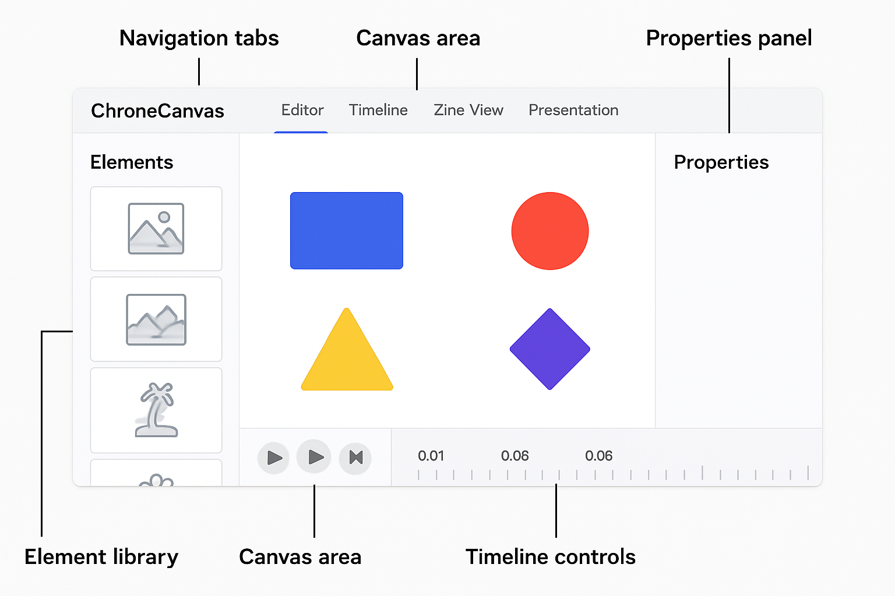
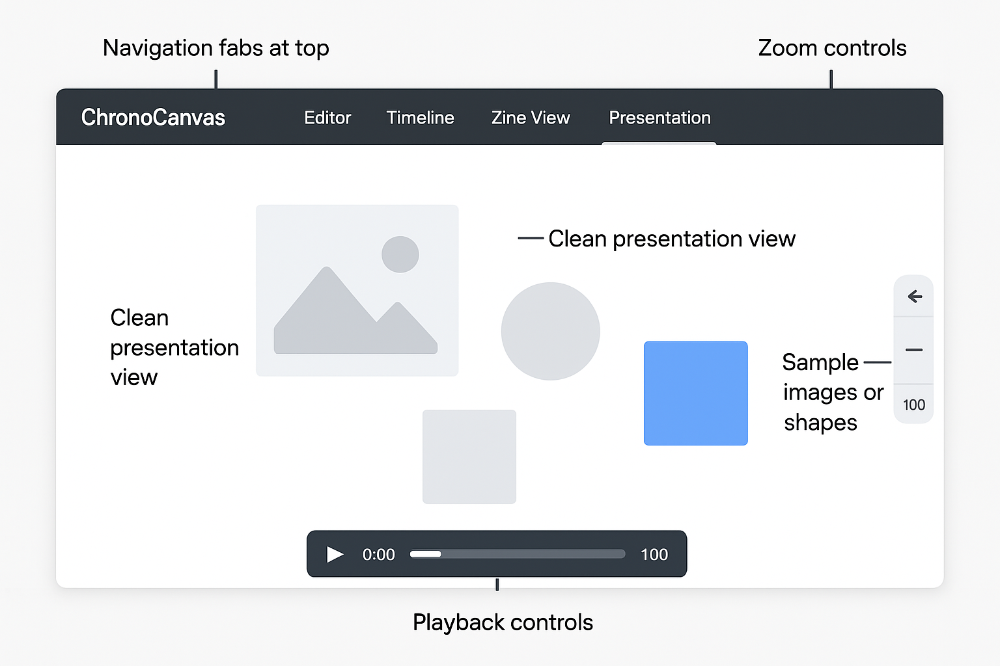

# ChronoCanvas

ChronoCanvas is a web application that combines a time-based moodboard with an interactive zine-like viewing experience. It allows users to create visual narratives by placing elements on a canvas and associating them with specific points on a timeline.

## User Interface

### Editor Mode


The Editor Mode is the main workspace where you can create and modify your canvas:

1. **Navigation Tabs**: Switch between different viewing modes (Editor, Timeline, Zine View, Presentation)
2. **Element Library**: Browse and select from various elements to add to your canvas
3. **Canvas Area**: The main workspace where you arrange and manipulate elements
4. **Properties Panel**: Adjust settings and properties of selected elements
5. **Timeline Controls**: Manage the timing and animation of elements on your canvas

### Presentation Mode


The Presentation Mode provides a clean view for showcasing your creation:

1. **Navigation Tabs**: Easily switch back to editing when needed
2. **Clean Presentation View**: Distraction-free view of your content
3. **Sample Images or Shapes**: Your content appears according to the timeline
4. **Playback Controls**: Control the playback of your timeline-based presentation
5. **Zoom Controls**: Adjust the view size as needed

## Features

- **Time-based Moodboard**: Place elements on a canvas and associate them with specific timeline points
- **Interactive Zine Viewer**: Experience content through scroll-triggered animations
- **Multiple Content Types**: Add images, text, shapes, stickers, and media to your canvas
- **Sophisticated Animation System**: Create beautiful transitions and effects with support for:
  - Movement (translateX, translateY)
  - Rotation (rotate, rotateX, rotateY, rotateZ)
  - Scaling (scale, scaleX, scaleY)
  - Opacity changes
- **Multiple Viewing Modes**: Timeline scrubbing, presentation mode, and scroll-triggered zine mode
- **Image Upload**: Easily add your own images to the canvas
- **Responsive Design**: Works on desktop, tablet, and mobile devices

## Technology Stack

- React
- TypeScript
- Framer Motion for animations
- Tailwind CSS for styling
- React DnD for drag-and-drop functionality
- Vite for building and development

## Project Structure

```
chrono-canvas/
├── public/             # Static assets
├── src/                # Source code
│   ├── assets/         # Images, fonts, etc.
│   ├── components/     # React components
│   ├── context/        # React context providers
│   ├── hooks/          # Custom React hooks
│   ├── types/          # TypeScript type definitions
│   ├── utils/          # Utility functions
│   ├── App.tsx         # Main application component
│   └── main.tsx        # Application entry point
├── .gitignore          # Git ignore file
├── package.json        # Project dependencies and scripts
├── tsconfig.json       # TypeScript configuration
├── vite.config.ts      # Vite configuration
└── README.md           # Project documentation
```

## Getting Started

### Prerequisites

- Node.js (v16 or higher)
- npm or yarn

### Installation

1. Clone the repository
   ```
   git clone https://github.com/myidentity/hackathon-chrono-canvas.git
   cd hackathon-chrono-canvas
   ```

2. Install dependencies
   ```
   npm install
   # or
   yarn install
   ```

3. Start the development server
   ```
   npm run dev
   # or
   yarn dev
   ```

4. Open your browser and navigate to `http://localhost:5173`

## Usage Guide

### Creating a New Project

1. Start in **Editor Mode** by selecting the "Editor" tab
2. Add elements from the **Element Library** on the left
3. Position elements on the **Canvas Area**
4. Use the **Properties Panel** to customize elements
5. Set timing and animations using the **Timeline Controls**

### Previewing Your Project

1. Switch to **Presentation Mode** by clicking the "Presentation" tab
2. Use the **Playback Controls** to view your animated content
3. Adjust the view with **Zoom Controls** if needed

### Adding Your Own Images

1. In **Editor Mode**, click the image upload button in the toolbar
2. Select an image from your device
3. The uploaded image will appear on your canvas
4. Position and customize as needed

## Development Workflow

This project follows a specific branching strategy:

- `main`: Stable, production-ready code
- `development`: Integration branch for features
- Feature branches: Created for each specific feature (e.g., `feature/timeline-component`)
- Hotfix branches: For urgent fixes from main

## License

This project is part of the Code Circuit Hackathon and is not licensed for public use.

## Acknowledgments

- Created for the Code Circuit Hackathon
- Inspired by visual trip moodboards and interactive zine viewers
